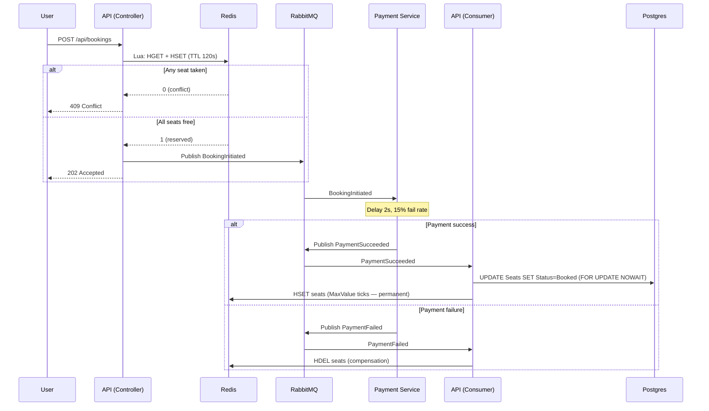

# SeatGrid — Architecture & Full Request Flow

> A learning reference that explains what the system does, how each piece connects,
> and which technologies and patterns are used at every step.

---

## Table of Contents

1. [Project Purpose](#1-project-purpose)
2. [Solution Structure](#2-solution-structure)
3. [Infrastructure at a Glance](#3-infrastructure-at-a-glance)
4. [Domain Model](#4-domain-model)
5. [Full Booking Flow (End-to-End)](#5-full-booking-flow-end-to-end)
   - 5.1 [POST /api/bookings — the fast path](#51-post-apibookings--the-fast-path)
   - 5.2 [Payment processing (async)](#52-payment-processing-async)
   - 5.3 [Booking finalization (success)](#53-booking-finalization-success)
   - 5.4 [Booking compensation (failure)](#54-booking-compensation-failure)
6. [Events API](#6-events-api)
7. [Architecture Layers & Patterns](#7-architecture-layers--patterns)
   - 7.1 [Clean Architecture](#71-clean-architecture)
   - 7.2 [Strategy Pattern — Booking Strategies](#72-strategy-pattern--booking-strategies)
   - 7.3 [Decorator Pattern — Instrumented Cache](#73-decorator-pattern--instrumented-cache)
   - 7.4 [Result Pattern](#74-result-pattern)
   - 7.5 [Choreography Saga](#75-choreography-saga)
8. [Redis Cache Layer in Detail](#8-redis-cache-layer-in-detail)
9. [Database Layer in Detail](#9-database-layer-in-detail)
10. [Message Bus in Detail](#10-message-bus-in-detail)
11. [Background Services](#11-background-services)
12. [Observability Stack](#12-observability-stack)
13. [Health Checks](#13-health-checks)
14. [Configuration Reference](#14-configuration-reference)
15. [Local Setup Overview](#15-local-setup-overview)
16. [Key Libraries Reference](#16-key-libraries-reference)
17. [Load Tests (k6)](#17-load-tests-k6)
    - 17.1 [baseline_test.js — Gentle Ramp, Read + Write](#baselinetestjs--gentle-ramp-read--write)
    - 17.2 [crash_test.js — High Concurrency, Write Only](#crash_testjs--high-concurrency-write-only)
    - 17.3 [async_saga_test.js — Full Saga at Scale](#async_saga_testjs--full-saga-at-scale)
    - 17.4 [k6 Concepts Glossary](#k6-concepts-glossary)

---

## 1. Project Purpose

SeatGrid is a high-concurrency ticket-booking platform built to explore
system-design problems that appear under flash-sale load (e.g., 100,000 users
clicking "Buy" at the same moment). The core challenge: **sell each seat exactly
once, never twice**, while keeping the booking path fast and non-blocking.

The project is implemented as a learning vehicle, deliberately covering:

- competing concurrency strategies (naive → pessimistic → optimistic locking)
- a Redis-based reservation gate-keeper that rejects conflicts before they hit the DB
- an async payment flow using a Choreography Saga over RabbitMQ
- full observability via OpenTelemetry → Prometheus / Loki / Tempo → Grafana

---

## 2. Solution Structure

```
SeatGrid.sln
├── src/
│   ├── SeatGrid.API              ← Main web API (ASP.NET Core 9)
│   │   ├── Controllers/          ← HTTP entry points
│   │   ├── Domain/               ← Entities, enums, repository interfaces
│   │   ├── Application/          ← Services, consumers, decorators, DTOs, interfaces
│   │   └── Infrastructure/       ← EF Core DbContext, repositories
│   ├── SeatGrid.PaymentService   ← Worker service (background host, no HTTP)
│   └── SeatGrid.Contracts        ← Shared integration-event records
├── deploy/observability/         ← OTel Collector, Prometheus, Loki, Tempo, Grafana configs
├── docker-compose.infra.yml      ← All infra services (Postgres, Redis, RabbitMQ, telemetry stack)
└── docker-compose.app.yml        ← Application services (API + PaymentService)
```

**Projects and their roles:**

| Project | SDK | Role |
|---|---|---|
| `SeatGrid.API` | `Microsoft.NET.Sdk.Web` | ASP.NET Core API + message consumer |
| `SeatGrid.PaymentService` | `Microsoft.NET.Sdk.Worker` | Worker host, consumes booking events, publishes payment results |
| `SeatGrid.Contracts` | `Microsoft.NET.Sdk` | Shared integration-event record types (no dependencies) |

---

## 3. Infrastructure at a Glance

All infrastructure runs in Docker containers.

| Service | Image | Port | Purpose |
|---|---|---|---|
| **PostgreSQL 16** | `postgres:16-alpine` | 5432 | Primary relational store (events, seats) |
| **Redis** | `redis:alpine` | 6379 | Seat reservation cache; atomic check-and-set |
| **RabbitMQ** | (configured in compose) | 5672 / 15672 | Message broker for saga choreography |
| **OTel Collector** | `otel/opentelemetry-collector-contrib` | 4317 (gRPC) / 4318 (HTTP) / 8889 (Prometheus) | Telemetry pipeline: receives OTLP, routes to backends |
| **Prometheus** | `prom/prometheus` | 9090 | Scrapes metrics from OTel Collector; evaluates alert rules |
| **Loki** | `grafana/loki` | 3100 | Log aggregation backend |
| **Tempo** | `grafana/tempo` | 3200 | Distributed trace backend |
| **Grafana** | `grafana/grafana` | 3000 | Unified dashboard: Prometheus + Loki + Tempo data sources |

---

## 4. Domain Model

Located in `SeatGrid.API/Domain/`.

### Entities

```
Event
├── Id         (long, PK, auto-generated)
├── Name       (string, required, max 100)
├── Date       (DateTime)
├── Rows       (int)
└── Cols       (int)

Seat
├── Id               (long, PK)
├── EventId          (long, FK → Event, cascade delete)
├── Row              (string, max 10)
├── Col              (string, max 10)
├── Status           (SeatStatus, [ConcurrencyCheck])
└── CurrentHolderId  (string?, [ConcurrencyCheck])
```

### SeatStatus enum

| Value | Meaning |
|---|---|
| `Available = 0` | Free, can be reserved |
| `Reserved = 1` | Held in Redis (TTL active), payment in progress |
| `Booked = 2` | Persisted to DB after successful payment |

> **Note on `[ConcurrencyCheck]`**: Both `Status` and `CurrentHolderId` carry this
> attribute. EF Core includes changed values in the `WHERE` clause of every `UPDATE`
> statement, so a concurrent write from another process will cause `SaveChangesAsync`
> to throw `DbUpdateConcurrencyException`. This is how **optimistic locking** is
> implemented without adding a separate `RowVersion` column.

### Database Schema (EF Core Fluent Configuration)

- `Events`: primary key on `Id`, `Name` required/max 100.
- `Seats`: primary key on `Id`, composite **unique index** on `(EventId, Row, Col)`,
  foreign key back to `Events` with cascade delete.

---

## 5. Full Booking Flow (End-to-End)

The booking flow is a **Choreography Saga** across three participants:
`BookingsController` → `PaymentService` → `BookingFinalizerConsumer`.

```
┌────────┐   POST /api/bookings   ┌───────────────┐
│ Client │ ────────────────────► │ BookingsCtrl  │
└────────┘                        └───────┬───────┘
                                          │ 1. TryReserveSeats (Redis Lua)
                                          │ 2. Publish BookingInitiated (RabbitMQ)
                                          │ 3. Return 202 Accepted
                                          ▼
                                   ┌──────────────┐
                                   │  RabbitMQ    │
                                   └──────┬───────┘
                                          │
                        ┌─────────────────┤
                        ▼                 ▼
               ┌────────────────┐  ┌────────────────────┐
               │ PaymentService │  │  BookingFinalizer  │
               │  (consumer)    │  │  (waits for result)│
               └───────┬────────┘  └────────────────────┘
                       │ PaymentSucceeded / PaymentFailed
                       ▼
                  RabbitMQ
                       │
                       ▼
             ┌──────────────────────┐
             │  BookingFinalizer    │
             │  Consumer (API host) │
             └──────────┬───────────┘
                        │ Success path: BookSeats (DB) + persist Redis
                        │ Failure path: ReleaseSeats (Redis compensation)
                        ▼
                   PostgreSQL / Redis
```

### 5.1 `POST /api/bookings` — the fast path

**Controller**: `BookingsController`  
**File**: `Controllers/BookingsController.cs`

```
Client sends:
  POST /api/bookings
  { "eventId": 1, "userId": "user-42", "seats": [{"row":"5","col":"3"}] }
```

**Step 1 — Redis Gatekeeper (atomic reservation)**

`BookingsController` calls `IBookedSeatsCache.TryReserveSeatsAsync(eventId, seats, TTL=120s)`.

Inside `BookedSeatsCache.TryReserveSeatsAsync`:

1. Builds a Lua script call against a Redis `HASH` key `event:{eventId}:seats`.
2. The Lua script runs **atomically** on the Redis server (Redis is single-threaded for Lua):
   - For each requested seat (`{Row}-{Col}` field in the hash), reads the stored value (expiration timestamp as ticks).
   - If any seat has a stored value and its expiration is in the future → returns `0` (conflict).
   - If all seats are free (no entry, or entry with an expired timestamp) → sets all seats with the new expiration timestamp → returns `1` (success).
3. Sets a 24-hour `EXPIRE` on the whole hash key (safety net against leaked keys).

**Why Lua?** Redis executes Lua scripts atomically. Without it, a classic
Check-Then-Act race between two concurrent requests would be possible even on Redis.

**Result:**
- Conflict → HTTP `409 Conflict` returned immediately. No DB write.
- Reserved → proceed to Step 2.

**Step 2 — Publish `BookingInitiated` to RabbitMQ**

```csharp
await _publishEndpoint.Publish(new BookingInitiated {
    OrderId   = Guid.NewGuid(),
    EventId   = request.EventId,
    Seats     = ...,
    UserId    = request.UserId,
    CreatedAt = DateTime.UtcNow
});
```

`IPublishEndpoint` is injected by **MassTransit**. The event is published to RabbitMQ via the configured transport.

**Compensation**: if `Publish` throws (broker unavailable), the `catch` block calls
`ReleaseSeatsAsync` to delete the hash fields that were just set — restoring Redis to
a clean state. This is a **synchronous compensation** within the request scope.

**Step 3 — Return `202 Accepted`**

The Controller returns immediately. The client receives `202 Accepted` with a message
"Booking initiated. Please wait for payment confirmation." The payment and finalization
happen asynchronously.

---

### 5.2 Payment processing (async)

**Service**: `SeatGrid.PaymentService`  
**Consumer**: `PaymentConsumer`  
**File**: `SeatGrid.PaymentService/PaymentConsumer.cs`

`PaymentConsumer` implements `IConsumer<BookingInitiated>` (MassTransit).

1. Receives the `BookingInitiated` message from RabbitMQ.
2. Simulates a 2-second payment processing delay (`Task.Delay(2000)`).
3. Simulates a 15% failure rate (`Random.NextDouble() < 0.15`).
4. Publishes **one** of two integration events back to RabbitMQ:
   - `PaymentSucceeded { OrderId, EventId, Seats, UserId, ProcessedAt }`
   - `PaymentFailed { OrderId, EventId, Seats, Reason, ProcessedAt }`

---

### 5.3 Booking finalization (success)

**Consumer**: `BookingFinalizerConsumer.Consume(ConsumeContext<PaymentSucceeded>)`  
**File**: `Application/Consumers/BookingFinalizerConsumer.cs`

Receives `PaymentSucceeded` from RabbitMQ.

**Step 1 — Persist to PostgreSQL**

Calls `IBookingService.BookSeatsAsync(eventId, userId, seatPairs)`.

The concrete implementation is selected at startup via the **Strategy Pattern**
(see §7.2). Default: `BookingPessimisticService`.

`BookingPessimisticService`:
- Opens a `ReadCommitted` transaction.
- Issues a native SQL `SELECT ... FOR UPDATE NOWAIT` for the exact seat rows
  (PostgreSQL row-level lock, fails immediately if locked by another transaction).
- Validates all seats exist and are available.
- Updates `Status = Booked`, `CurrentHolderId = userId`.
- Commits.

Returns `Result<BookingSuccess, BookingError>`.

**Step 2 — Make Redis reservation permanent**

On success, calls `IBookedSeatsCache.AddBookedSeatsAsync(eventId, seatPairs)`.

This calls `HSET` on the same hash with `timestamp = DateTime.MaxValue.Ticks` —
effectively replacing the TTL-bounded reservation entry with a permanent one.
The 24-hour `EXPIRE` on the hash key remains as a safety net.

**On DB failure** (e.g., seat already booked by a duplicate message): calls
`ReleaseSeatsAsync` to remove the hash fields. This is the **asynchronous
compensation** path.

**On exception**: re-throws so MassTransit can retry the message (see §10).

---

### 5.4 Booking compensation (failure)

**Consumer**: `BookingFinalizerConsumer.Consume(ConsumeContext<PaymentFailed>)`

Receives `PaymentFailed`. Calls `IBookedSeatsCache.ReleaseSeatsAsync(eventId, seatPairs)`.

This executes `HDEL event:{eventId}:seats field1 field2 ...` — removing the reserved
entries so the seats become available for new bookings.

---

## 6. Events API

**Controller**: `EventsController`  
**Service**: `EventService`

| Endpoint | Description |
|---|---|
| `POST /api/events` | Creates an event + generates `Rows × Cols` seat records in PostgreSQL |
| `GET /api/events/{id}/seats` | Returns all seats for an event with their current `Status` |
| `POST /api/events/{id}/warmup` | Loads all `Booked` seats from DB into Redis (cache warm-up) |

**Cache warm-up** (`WarmupCacheAsync`): queries all seats for the event from PostgreSQL,
filters `Status == Booked`, and batch-writes them to Redis via `AddBookedSeatsAsync`.
Useful after a Redis restart to restore the cache state from the authoritative DB.

---

## 7. Architecture Layers & Patterns

### 7.1 Clean Architecture

The `SeatGrid.API` project follows Clean Architecture with strict dependency direction:
Domain ← Application ← Infrastructure, API.

```
┌──────────────────────────────────┐
│  Controllers (API layer)         │  HTTP in/out, DTOs, IPublishEndpoint
├──────────────────────────────────┤
│  Application layer               │  Services, Consumers, Decorators,
│                                  │  Interfaces, DTOs, Observability
├──────────────────────────────────┤
│  Domain layer                    │  Entities, Enums, IEventRepository
├──────────────────────────────────┤
│  Infrastructure layer            │  SeatGridDbContext, EventRepository
└──────────────────────────────────┘
```

- **Domain** has zero dependencies on any framework or library.
- **Application** depends only on Domain interfaces. It never takes `DbContext` directly.
- **Infrastructure** implements Domain interfaces (`IEventRepository`) using EF Core.
- **Controllers** depend on Application interfaces (`IBookingService`, `IBookedSeatsCache`, `IEventService`).
- **DI composition** (binding interfaces to implementations) happens entirely in `Program.cs`.

### 7.2 Strategy Pattern — Booking Strategies

Three implementations of `IBookingService` exist, all registered in DI. The **factory
delegate** in `Program.cs` reads `Booking:Strategy` from configuration and resolves
the correct concrete type:

```csharp
builder.Services.AddScoped<IBookingService>(sp =>
{
    var strategy = configuration.GetValue<string>("Booking:Strategy");
    var map = new Dictionary<string, Func<IServiceProvider, IBookingService>> {
        ["naive"]       = sp => sp.GetRequiredService<BookingNaiveService>(),
        ["pessimistic"] = sp => sp.GetRequiredService<BookingPessimisticService>(),
        ["optimistic"]  = sp => sp.GetRequiredService<BookingOptimisticService>(),
    };
    return map[strategy](sp);
});
```

| Strategy | Concurrency mechanism | Pros | Cons |
|---|---|---|---|
| `naive` | Basic transaction, no locks | Baseline; shows the problem | Double-booking possible under load |
| `pessimistic` | PostgreSQL `SELECT ... FOR UPDATE NOWAIT` | Strict consistency | Blocks other writes; deadlock risk at extreme scale |
| `optimistic` | EF Core `[ConcurrencyCheck]` on `Status` + `CurrentHolderId` | No DB locks; higher throughput at low contention | Fails (retryable error) if another transaction wins; needs client retry |

**Pessimistic locking detail**: the raw SQL query
```sql
SELECT * FROM "Seats"
WHERE "EventId" = {0}
  AND ("Row", "Col") IN (VALUES (...))
FOR UPDATE NOWAIT
```
uses PostgreSQL's tuple `IN` syntax to lock exactly the requested seats in a single
statement. `NOWAIT` means the query fails immediately (throws `PostgresException`) if
any seat is already locked, avoiding deadlocks from indefinite waits.

**Optimistic locking detail**: EF Core generates
```sql
UPDATE "Seats"
SET "Status" = @newStatus, "CurrentHolderId" = @userId
WHERE "Id" = @id
  AND "Status" = @originalStatus          -- [ConcurrencyCheck]
  AND "CurrentHolderId" = @originalHolder  -- [ConcurrencyCheck]
```
If `affectedRows < expected`, EF Core throws `DbUpdateConcurrencyException`, which
`BookingOptimisticService` maps to a `BookingError` result.

### 7.3 Decorator Pattern — Instrumented Cache

`IBookedSeatsCache` has two implementations:
1. `BookedSeatsCache` — the real Redis implementation.
2. `InstrumentedBookedSeatsCache` — a decorator that wraps `BookedSeatsCache`.

Registration in DI:
```csharp
builder.Services.AddScoped<BookedSeatsCache>(); // concrete, resolved by name

builder.Services.AddScoped<IBookedSeatsCache>(sp => {
    var inner  = sp.GetRequiredService<BookedSeatsCache>();
    var logger = sp.GetRequiredService<ILogger<InstrumentedBookedSeatsCache>>();
    return new InstrumentedBookedSeatsCache(inner, logger);
});
```

Every method in the decorator:
1. Starts a `Stopwatch`.
2. Calls the inner method.
3. Records duration via `BookingMetrics.RecordCacheOperationDuration(ms, cacheType, operation)`.
4. Records outcome counters via `BookingMetrics.RecordCacheCheck(cacheType, result)`.

This separates observability from business logic. `BookedSeatsCache` contains no
metrics code; `InstrumentedBookedSeatsCache` contains no Redis code.

### 7.4 Result Pattern

All booking service methods return `Result<TSuccess, TError>` instead of throwing
exceptions for expected business failures (seat unavailable, seat not found).

```csharp
public class Result<TSuccess, TError>
{
    public bool IsSuccess { get; }
    public TResult Match<TResult>(
        Func<TSuccess, TResult> onSuccess,
        Func<TError, TResult> onFailure) { ... }
}
```

Callers use `Match()` to handle both branches without `try/catch` for domain errors.
Only infrastructure exceptions (DB I/O failure, Redis connection drop) propagate as
actual exceptions.

### 7.5 Choreography Saga

The booking transaction spanning `SeatGrid.API` (reservation + finalization) and
`SeatGrid.PaymentService` (payment) uses **Choreography Saga** — each participant
reacts to events and publishes new events, with no central orchestrator.

Compensation (rollback) is explicit:
- If `Publish` fails after Redis reserve → `ReleaseSeatsAsync` in the controller.
- If DB booking fails after `PaymentSucceeded` → `ReleaseSeatsAsync` in the consumer.
- If `PaymentFailed` arrives → `ReleaseSeatsAsync` in the consumer.

The saga has **no durable state store** for the saga itself. Redis serves as the
temporary state (TTL-bound reservation). If the API process crashes between Redis
reserve and DB commit, the `CacheReconciliationService` eventually cleans up the
orphaned Redis entry (see §11).

---

## 8. Redis Cache Layer in Detail

**Client library**: `StackExchange.Redis` (direct) + `Microsoft.Extensions.Caching.StackExchangeRedis` (IDistributedCache).

**Data structure**: Redis `HASH` per event.  
Key: `event:{eventId}:seats`  
Fields: `{Row}-{Col}` → value: expiration timestamp (UTC ticks as string).

### Operations

| Method | Redis command(s) | Purpose |
|---|---|---|
| `TryReserveSeatsAsync` | Lua script: `HGET` × N, `HSET` × N, `EXPIRE` | Atomic check-and-reserve with TTL |
| `AddBookedSeatsAsync` | `HSET` (batch), `EXPIRE` | Make reservation permanent after payment |
| `ReleaseSeatsAsync` | `HDEL` (batch) | Compensation: remove reserved/stale entries |
| `GetStaleSeatKeysAsync` | `HGETALL` | Return field names where timestamp < (now − threshold) |

### TTL semantics

- **Temporary reservation**: stored as `DateTime.UtcNow.Add(ttl).Ticks` (120 seconds by default).
- **Permanent booking**: stored as `DateTime.MaxValue.Ticks`.
- **Stale detection**: entries where the stored ticks value is less than `(now - threshold).Ticks`.

### Lua script (TryReserveSeatsAsync)

The Lua script is executed via `IDatabase.ScriptEvaluateAsync`. It performs:
1. Read all requested fields with `HGET`.
2. If any field exists and its timestamp is in the future → `return 0`.
3. If all fields are free → `HSET` all fields → `return 1`.
4. Set a 24h `EXPIRE` on the key if it has no expiration.

Atomicity guarantee: Redis processes the entire script as a single serialized operation.
No other Redis command can interleave between the check and the set.

### Connection setup

`IConnectionMultiplexer` is registered as a **singleton** (`AbortOnConnectFail = true`):
the application deliberately fails to start if Redis is unreachable. The rationale: a
running API without Redis would accept bookings without the conflict-prevention gate,
making double-booking possible.

---

## 9. Database Layer in Detail

**ORM**: Entity Framework Core 9  
**Provider**: `Npgsql.EntityFrameworkCore.PostgreSQL`  
**Database**: PostgreSQL 16

### EF Core setup

`SeatGridDbContext` is registered as scoped:
```csharp
builder.Services.AddDbContext<SeatGridDbContext>(options =>
    options.UseNpgsql(connectionString));
```

`OnModelCreating` configures:
- `Event.Name`: required, max length 100.
- `Seat.(EventId, Row, Col)`: composite unique index.
- `Seat.EventId`: FK to `Event`, cascade delete.
- Concurrency tokens: configured implicitly via `[ConcurrencyCheck]` data annotations
  on `Seat.Status` and `Seat.CurrentHolderId`.

### Migrations

Code-first migrations live in `SeatGrid.API/Migrations/`.
`db.Database.Migrate()` is called at startup inside a scoped service scope, so
migrations run automatically when the container starts.

### Repository pattern

`IEventRepository` (Domain) is implemented by `EventRepository` (Infrastructure).
Application services receive `IEventRepository` via DI — they never reference
`SeatGridDbContext` directly (except `BookingPessimisticService` and
`BookingOptimisticService`, which receive it directly because they need raw SQL /
EF change-tracking behaviour that cannot be abstracted through the repository).

### Raw SQL in services

Both `BookingPessimisticService` and `BookingOptimisticService` use
`DbSet<Seat>.FromSqlRaw(...)` to build a `VALUES (...)` tuple clause for multi-seat
lookup in a single query. The `EventId` parameter is fully parameterized; the
Row/Col values are escaped manually (`Replace("'","''")`). The `#pragma warning
disable EF1002` suppression acknowledges the deviation from full parameterization
for the dynamic tuple clause.

---

## 10. Message Bus in Detail

**Library**: MassTransit 8.x  
**Transport**: RabbitMQ

### Why MassTransit over raw RabbitMQ?

MassTransit adds above the transport:
- Consumer lifecycle management (scoped DI per message, `IConsumer<T>` interface).
- Automatic queue/exchange/binding topology via `ConfigureEndpoints(context)`.
- Built-in retry policies, dead-letter exchange (error queue) support.
- `IPublishEndpoint` and `IConsumer<T>` abstractions that keep code transport-agnostic.

### Topology (auto-generated)

`cfg.ConfigureEndpoints(context)` creates:
- For `BookingFinalizerConsumer`: a queue named by convention, bound to exchanges for
  `PaymentSucceeded` and `PaymentFailed`.
- For `PaymentConsumer` (in PaymentService): a queue bound to the exchange for
  `BookingInitiated`.

MassTransit uses the **fanout exchange → queue** topology on RabbitMQ. Each message
type gets its own exchange; consumers bind queues to those exchanges.

### Integration Events (SeatGrid.Contracts)

All three event types are C# `record` types (immutable, value-equality):

| Record | Published by | Consumed by |
|---|---|---|
| `BookingInitiated` | `BookingsController` | `PaymentConsumer` |
| `PaymentSucceeded` | `PaymentConsumer` | `BookingFinalizerConsumer` |
| `PaymentFailed` | `PaymentConsumer` | `BookingFinalizerConsumer` |

The `SeatGrid.Contracts` project is referenced by both `SeatGrid.API` and
`SeatGrid.PaymentService` — it is the single source of truth for shared message shapes.

### Retry behaviour

MassTransit retries message delivery on unhandled exceptions (re-throws from
`BookingFinalizerConsumer.Consume`). After retries exhaust, the message moves to the
error queue (`*_error` exchange). This prevents message loss for transient DB failures.

---

## 11. Background Services

### CacheReconciliationService

**Base class**: `BackgroundService` (ASP.NET Core hosted service)  
**File**: `Application/Services/CacheReconciliationService.cs`  
**Schedule**: every 60 seconds.

**Problem it solves**: "ghost seats" — entries in Redis that were never cleaned up
because the application crashed between the Redis reservation and the DB commit
(or because the payment result message was never processed).

**Algorithm**:
1. Load all active events from PostgreSQL (`IEventRepository.GetActiveEventsAsync`).
2. For each event, call `IBookedSeatsCache.GetStaleSeatKeysAsync(eventId, threshold=30s)` — returns all fields in the Redis hash whose stored timestamp expired more than 30 seconds ago.
3. Load all `Available` seats for the event from PostgreSQL.
4. If a stale Redis key corresponds to a seat that is `Available` in DB → it is a ghost.
   (A seat that is `Booked` in DB and stale in Redis is fine — DB is authoritative.)
5. Call `ReleaseSeatsAsync` for all ghost seats.

**Why scoped services from a singleton host**: `BackgroundService` is registered as a singleton. It receives only `IServiceProvider` in the constructor and calls `CreateScope()` in each reconciliation cycle to resolve scoped dependencies (`IBookedSeatsCache`, `IEventRepository`) safely.

---

## 12. Observability Stack

### OpenTelemetry SDK (in-process)

Configured in `Program.cs` for the `SeatGrid.API` service name.

**Traces** (distributed tracing):
- `AddAspNetCoreInstrumentation()` — spans for every HTTP request.
- `AddEntityFrameworkCoreInstrumentation(SetDbStatementForText = true)` — spans per SQL query, with the query text attached (disable in production).
- `AddRedisInstrumentation()` — spans per Redis command via StackExchange.Redis.

**Metrics**:
- `AddAspNetCoreInstrumentation()` — HTTP request counters, duration histograms.
- `AddRuntimeInstrumentation()` — GC, thread pool, heap metrics.
- `AddMeter("SeatGrid.API")` — custom application metrics (see below).

**Logs**:
- `builder.Logging.AddOpenTelemetry(...)` — structured logs forwarded via OTLP.

**Exporter**: OTLP (HTTP/gRPC) to the OTel Collector at `OTEL_EXPORTER_OTLP_ENDPOINT`
(default `http://localhost:4318`). The endpoint is probed at startup — a warning is
logged if unreachable, but the application still starts.

### Custom Metrics (BookingMetrics)

**File**: `Application/Observability/BookingMetrics.cs`  
**Meter name**: `SeatGrid.API`

| Metric | Type | Tags | Purpose |
|---|---|---|---|
| `seatgrid.booking.cache_checks` | Counter | `cache_type`, `result` | Count reservation attempts by outcome: `reserved`, `conflict`, `released`, `stale_found` |
| `seatgrid.booking.db_queries` | Counter | `query_type` | Count DB queries by type |
| `seatgrid.booking.duration` | Histogram | — | End-to-end booking duration (ms) |
| `seatgrid.cache.operation_duration` | Histogram | `cache_type`, `operation` | Redis operation duration per operation type |

All custom metrics are recorded by `InstrumentedBookedSeatsCache` (the decorator).

### OTel Collector Pipeline

```
Applications (OTLP gRPC/HTTP)
        │
        ▼
┌──────────────────┐
│  OTel Collector  │
│  ┌────────────┐  │
│  │  batch     │  │  (buffers and batches telemetry)
│  └─────┬──────┘  │
└────────┼─────────┘
         ├── Traces  →  Tempo  (port 4317)
         ├── Metrics → Prometheus (scrapes port 8889)
         └── Logs   →  Loki   (HTTP push)
```

### Grafana Dashboards

Pre-provisioned via `deploy/observability/grafana/`:
- `datasources.yaml` declares Prometheus, Loki, and Tempo data sources.
- `dashboards.yaml` points to the `dashboards/` directory for auto-loaded JSON dashboards.
- **Trace correlation**: Tempo data source is linked to Loki and Prometheus, enabling
  click-through from a log line or metric to the originating distributed trace.

### Prometheus Alerting

Alert rules in `deploy/observability/alerts.yml` are loaded by Prometheus. These can
define thresholds on custom SeatGrid metrics (e.g., high conflict rates, latency
spikes).

---

## 13. Health Checks

Three endpoints, each with a different purpose:

| Endpoint | Check | Returns |
|---|---|---|
| `GET /health/live` | None (always 200 if the process responds) | Kubernetes liveness probe |
| `GET /health/ready` | PostgreSQL connectivity + Redis connectivity | Kubernetes readiness probe |
| `GET /health/observability` | None (generates a trace/metric itself) | Verify OTel pipeline |

**Readiness checks** use:
- `AspNetCore.HealthChecks.NpgSql` — executes a test query against PostgreSQL.
- `AspNetCore.HealthChecks.Redis` — pings Redis.
Both have a 3-second timeout. The API container in Docker Compose starts only after
`postgres` and `redis` are healthy (`depends_on: condition: service_healthy`).

---

## 14. Configuration Reference

| Key | Default | Description |
|---|---|---|
| `ConnectionStrings:DefaultConnection` | `Host=localhost;Port=5432;...` | PostgreSQL connection string |
| `ConnectionStrings:Redis` | `localhost:6379` | Redis connection string |
| `Booking:Strategy` | `pessimistic` | Active booking strategy: `naive`, `pessimistic`, `optimistic` |
| `Caching:SeatMapTtl` | `30` | (Reserved for future seat-map cache TTL in seconds) |
| `Caching:EnableRedisCache` | `true` | Feature flag (reserved) |
| `RabbitMQ:Host` | `localhost` | RabbitMQ hostname |
| `OTEL_EXPORTER_OTLP_ENDPOINT` | `http://localhost:4318` | OTel Collector endpoint |

In Docker Compose (`docker-compose.app.yml`), these are overridden with container
hostnames: `postgres`, `redis`, `rabbitmq`, `otel-collector`.

---

## 15. Local Setup Overview

```bash
# 1. Start all infrastructure
docker compose -f docker-compose.infra.yml up -d

# 2. Start the applications
docker compose -f docker-compose.app.yml up -d

# Or run API locally (migrations apply automatically):
cd src/SeatGrid.API
dotnet run
```

EF Core migrations apply automatically at startup (`db.Database.Migrate()`).

**Grafana**: http://localhost:3000 (anonymous admin, no login required)  
**Prometheus**: http://localhost:9090  
**RabbitMQ management UI**: http://localhost:15672 (guest/guest)  
**API Swagger** (Development): http://localhost:5000/openapi  

---

## 16. Key Libraries Reference

| Library | Version | Used for |
|---|---|---|
| **MassTransit** | 8.3.x / 8.5.x | Message bus abstraction over RabbitMQ. Consumer lifecycle, topology auto-config, retry/dead-letter. |
| **MassTransit.RabbitMQ** | same | RabbitMQ transport for MassTransit. |
| **Npgsql.EntityFrameworkCore.PostgreSQL** | 9.0.x | EF Core provider for PostgreSQL. Maps C# entities to PG tables, supports `FOR UPDATE` via raw SQL. |
| **Microsoft.EntityFrameworkCore** | 9.0.x | ORM. Change tracking, `[ConcurrencyCheck]`, code-first migrations, `DbUpdateConcurrencyException`. |
| **StackExchange.Redis** | 2.10.x | Low-level Redis client. `IConnectionMultiplexer`, `ScriptEvaluateAsync` for Lua, `HashSetAsync`, `HashDeleteAsync`. |
| **Microsoft.Extensions.Caching.StackExchangeRedis** | 10.0.x | `IDistributedCache` backed by Redis (registered under `SeatGrid:` instance prefix). |
| **OpenTelemetry.Extensions.Hosting** | 1.14.x | OTel SDK integration with `IHostBuilder`. |
| **OpenTelemetry.Instrumentation.AspNetCore** | 1.14.x | Automatic HTTP request tracing and metrics. |
| **OpenTelemetry.Instrumentation.EntityFrameworkCore** | 1.0.0-beta | Automatic EF Core query tracing (span per SQL statement). |
| **OpenTelemetry.Instrumentation.StackExchangeRedis** | 1.14.0-beta | Automatic Redis command tracing. |
| **OpenTelemetry.Instrumentation.Runtime** | 1.14.x | .NET runtime metrics (GC, thread pool). |
| **OpenTelemetry.Exporter.OpenTelemetryProtocol** | 1.14.x | OTLP exporter (gRPC + HTTP) for traces, metrics, logs. |
| **AspNetCore.HealthChecks.NpgSql** | 9.0.x | PostgreSQL health check for `/health/ready`. |
| **AspNetCore.HealthChecks.Redis** | 9.0.x | Redis health check for `/health/ready`. |
| **Microsoft.AspNetCore.OpenApi** | 9.0.x | Generates OpenAPI (Swagger) spec from controller metadata. |

---

## 17. Load Tests (k6)

k6 is a JavaScript-based load testing tool. Each test file exports a `default` function
that k6 executes once per **Virtual User (VU)** per iteration, plus optional lifecycle
hooks: `setup()` (runs once before load), `teardown()` (runs once after load), and
`handleSummary()` (formats the final report).

**How to run:**
```bash
k6 run tests/k6/baseline_test.js
k6 run tests/k6/crash_test.js
k6 run tests/k6/async_saga_test.js
```

---

### `baseline_test.js` — Gentle Ramp, Read + Write

**Purpose**: establish a baseline for the system under low, realistic load.  
**File**: `tests/k6/baseline_test.js`

**Load shape** (`stages`):

```
VUs
10 ┤         ─────────────────────────
   │       /                           \
 0 ┼──────/─────────────────────────────\──► time
   0s    10s                          40s  50s
```

| Stage | Duration | VUs | Purpose |
|---|---|---|---|
| Ramp up | 10s | 0 → 10 | Warm up — avoids cold-start noise |
| Steady | 30s | 10 | Baseline measurement window |
| Ramp down | 10s | 10 → 0 | Graceful shutdown |

**Event**: 20×20 grid (400 seats), created once in `setup()`.

**Each VU iteration does:**
1. `GET /api/Events/{id}/seats` — read the seat map.
2. `POST /api/Bookings` with a randomly chosen seat (`Row` ∈ [1,20], `Col` ∈ [1,20]).
3. `sleep(1)` — 1-second think time between iterations.

**`userId`**: `user-{__VU}-{__ITER}` — a unique string per VU per iteration. This means
the same VU never retries the same logical booking, which keeps the idempotency path
in `BookingFinalizerConsumer` from hiding conflicts.

**What this test calls** (the synchronous booking path, not saga):
- `BookingController` → calls `IBookingService.BookSeatsAsync` directly (this was the
  pre-saga version of the controller, or the sync path on the endpoint). Expects `200 OK`
  on success.

> **Note**: This test expects `200 OK` (not `202 Accepted`), which means it targets the
> older synchronous booking path or a different strategy configuration. It tracks both
> `200` and `409` as valid outcomes.

**Custom counters tracked:**

| Counter | Meaning |
|---|---|
| `booking_success_200` | Seats successfully booked |
| `booking_conflict_409` | Redis gatekeeper rejected (seat already taken) |
| `booking_bad_request_400` | Malformed request |
| `booking_server_error_5xx` | System error — never expected |
| `seats_retrieved_200` | Seat-map reads that succeeded |

**What to look for in results:**
- `booking_server_error_5xx` should be 0. Any 5xx means DB or Redis is unstable.
- `booking_conflict_409` count grows as seats fill — healthy sign the conflict gate works.
- `http_req_duration` P95 / P99 — baseline for comparison against heavier tests.

---

### `crash_test.js` — High Concurrency, Write Only

**Purpose**: deliberately overload the system to discover where it breaks.  
**File**: `tests/k6/crash_test.js`

**Load shape:**

```
VUs
2000 ┤      ─────────────────────────
     │    /                           \
   0 ┼───/─────────────────────────────\──► time
     0s  10s                          40s  50s
```

| Stage | Duration | VUs | Purpose |
|---|---|---|---|
| Ramp up | 10s | 0 → 2000 | Simulate flash-sale spike |
| Hold | 20s | 2000 | Sustained extreme load |
| Ramp down | 10s | 2000 → 0 | |

**Event**: 10×10 grid = **100 seats**, 2000 concurrent VUs — a **20:1 contention ratio**.

**Each VU iteration:**
1. `POST /api/Bookings` with random seat, no read before write, no think time (`sleep(0.1)`).

**Threshold:**
```js
'http_req_duration': ['p(95)<2000']  // P95 must be under 2 seconds
```

A looser threshold than the async test because DB locking contention can spike latency.

**What this test exposes:**
- **Pessimistic strategy**: `FOR UPDATE NOWAIT` throws immediately when a row is
  locked → 500 or 409 depending on error handling. Very high 409 rates are expected
  and healthy.
- **Optimistic strategy**: `DbUpdateConcurrencyException` spikes under this contention
  ratio, revealing the cost of failed optimistic writes.
- **Naive strategy**: race conditions become visible — two VUs may both see a seat as
  `Available`, both commit, and one silently wins (or both succeed, creating a double-booking).
- **Redis gate**: because all 100 seats fill fast, most requests hit Redis and return
  `409` without touching the DB at all — this is the primary scalability mechanism.

**Checks:**
```js
'Status is 200 (Booked) or 409 (Conflict)': r.status === 200 || r.status === 409
'System did not crash (No 500s)': r.status !== 500
```

The second check is the most important. Any 500 means the system failed, not just the booking.

**Summary output** includes a derived metric:
```
Successful Bookings: N/100 seats (X% capacity)
```
This tells you how many of the 100 physical seats ended up booked. Under a working
Redis gate, this should approach `100` — every seat booked exactly once.

---

### `async_saga_test.js` — Full Saga at Scale

**Purpose**: validate the complete Choreography Saga under 2000 concurrent VUs,
including RabbitMQ, PaymentService, and BookingFinalizerConsumer.  
**File**: `tests/k6/async_saga_test.js`

**Load shape:** identical to `crash_test.js` — 2000 VUs, ramp up 10s / hold 20s / ramp down 10s.

**Event**: 10×10 = **100 seats**.

**Threshold:**
```js
'http_req_duration': ['p(95)<500']  // Much tighter — Redis-only path should be very fast
```

The 500ms P95 is achievable because `POST /api/Bookings` only touches Redis (Lua script)
and enqueues a message — it never blocks on the DB.

**Lifecycle:**

| Hook | What it does |
|---|---|
| `setup()` | Creates a fresh 10×10 event. Returns `{ eventId }` shared to all VUs. |
| `default(data)` | Each VU fires `POST /api/Bookings`, tracks `202`/`409`/`5xx`. |
| `teardown(data)` | Waits 10 seconds for the async pipeline to drain, then polls `GET /api/Events/{id}/seats` to count final `Booked` vs `Available`. |
| `handleSummary(data)` | Prints custom counter summary alongside k6 built-in report. |

**`userId`**: `user-{__VU}` (no `__ITER`) — the same VU always sends the same userId.
This means `BookingFinalizerConsumer` can apply its **idempotency check** (skip DB
update if same user already booked this seat), which prevents the 15% payment failure
compensation from permanently freeing a seat that the same VU managed to book in a
prior iteration.

**Custom counters:**

| Counter | Meaning |
|---|---|
| `booking_accepted_202` | Redis reservation succeeded; saga started |
| `booking_conflict_409` | Instant Redis rejection |
| `booking_error_5xx` | System error |

> **Critical insight**: `booking_accepted_202` ≠ confirmed bookings. ~15% of accepted
> bookings will be rolled back by `PaymentFailed` + `ReleaseSeatsAsync`. The true
> confirmed count is only visible in `teardown()` by polling seat status.

**What the teardown validates:**

```
Total Seats: 100
Booked:      ~85   (Expected ~85 — 85% payment success rate)
Available:   ~15   (Expected ~15 — seats released after PaymentFailed)
```

In practice, with enough VUs competing, a released seat gets claimed again almost
immediately, so the final `Booked` count typically reaches 100. The teardown comment
calls this out: "compensation releases seats fast enough for subsequent users to claim
them, resulting in 100% occupancy."

**What this test measures end-to-end:**
- Redis atomic Lua throughput under 2000 VUs.
- RabbitMQ message throughput (up to `booking_accepted_202` messages published in ~30s).
- PaymentService consumer throughput (each message takes ~2s to process).
- BookingFinalizerConsumer DB write throughput under the effective surviving message rate.
- `CacheReconciliationService` does not run during a 40s test but is described in the
  header comment as the eventual cleanup mechanism for queue backlogs.

---

### k6 Concepts Glossary

| Term | Meaning |
|---|---|
| **VU (Virtual User)** | A goroutine that runs the `default()` function in a loop. All VUs run concurrently. |
| **Iteration** | One execution of `default()` by one VU. `__VU` = VU number, `__ITER` = iteration count within that VU. |
| **Stage** | A `{ duration, target }` pair that linearly ramps VUs from the current count to `target` over `duration`. |
| **`ramping-vus` executor** | Runs VUs through defined stages; the standard executor for ramp-up/hold/ramp-down patterns. |
| **`Counter` metric** | Cumulative integer. Incremented with `.add(1)`. Visible in `handleSummary` via `data.metrics.<name>.values.count`. |
| **`check()`** | An assertion that does **not** abort the test on failure — it only increments pass/fail counters. Used to verify response codes. |
| **`threshold`** | A pass/fail criterion evaluated after the test. Failing a threshold sets the k6 exit code to non-zero (useful in CI). |
| **`setup()` / `teardown()`** | Run once each in a single VU before/after all load. `setup()` return value is passed as `data` to every VU's `default()`. |
| **`handleSummary()`** | Replaces or augments the default end-of-test report. Returns an object mapping output destination (`stdout`, file path) to content. |

---

## Appendix — Sequence Diagram (Choreography Saga)


