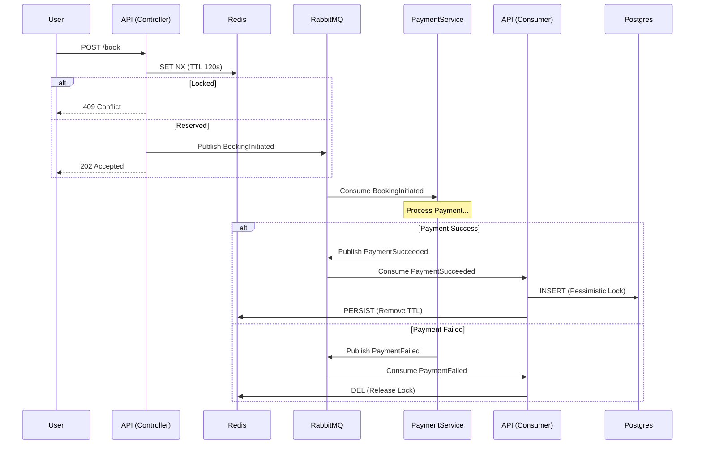

# Saga Pattern Sequence Diagram

This diagram illustrates the distributed transaction flow (Choreography Saga) implemented in Phase 4.

```mermaid
sequenceDiagram
    participant User
    participant API_Controller as API (Controller)
    participant Redis
    participant RabbitMQ
    participant PaymentService
    participant API_Consumer as API (Consumer)
    participant Postgres

    User->>API_Controller: POST /book
    API_Controller->>Redis: SET NX (TTL 120s)
    alt Locked
        API_Controller-->>User: 409 Conflict
    else Reserved
        API_Controller->>RabbitMQ: Publish BookingInitiated
        API_Controller-->>User: 202 Accepted
    end

    RabbitMQ->>PaymentService: Consume BookingInitiated
    Note over PaymentService: Process Payment...

    alt Payment Success
        PaymentService->>RabbitMQ: Publish PaymentSucceeded
        RabbitMQ->>API_Consumer: Consume PaymentSucceeded
        API_Consumer->>Postgres: INSERT (Pessimistic Lock)
        API_Consumer->>Redis: PERSIST (Remove TTL)
    else Payment Failed
        PaymentService->>RabbitMQ: Publish PaymentFailed
        RabbitMQ->>API_Consumer: Consume PaymentFailed
        API_Consumer->>Redis: DEL (Release Lock)
    end
```
